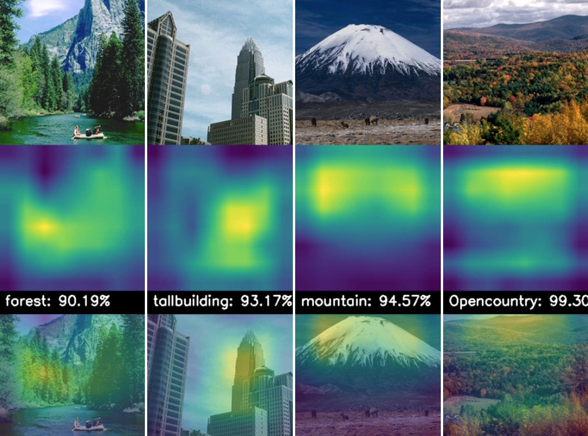

# MCV Module 3 - Machine Learning For Computer Vision

## Image Classification with Classic and Deep Learning Techniques

### [Paper](https://arxiv.org/abs/2105.04895)

## Summary
This repository contains the code related to the project on 'Image Classification on Large Datasets' of the [Module 3: Machine Learning for Computer Vision](https://pagines.uab.cat/mcv/content/m3-machine-learning-computer-vision) of the Master in Computer Vision at UAB. 

The aim of this master module is to implement an image classifier using both classic computer vision techniques (Bag of Visual Words classifier using SVM) and deep learning techniques (MLPs, InceptionV3 and our own CNN: TinyNet).

The module consists of 5 different deliveries that build up to a complete pipeline. Refer to the specifics `README.md` for further explanations, requirements and the complete code of each week.
 
### Week 1: Bag of Visual Words for Image Classification
- [code](https://github.com/IanRiera/MCV-M3-Machine-Learning-for-Computer-Vision/tree/main/week1)

### Week 2: Improving the Bag of Visual Words for Image Classification
- [code](https://github.com/IanRiera/MCV-M3-Machine-Learning-for-Computer-Vision/tree/main/week2)

### Week 3: Image Classification with MLPs
- [code](https://github.com/IanRiera/MCV-M3-Machine-Learning-for-Computer-Vision/tree/main/week3)
- [slides](https://docs.google.com/presentation/d/1GRrlxDp_QxT_IAb1mgJvjZzoNyA1bxDezZi6L2M6jEY/edit#slide=id.g35f391192_00)

### Week 4: Fine-tuning Inceptionv3
- [code](https://github.com/IanRiera/MCV-M3-Machine-Learning-for-Computer-Vision/tree/main/week4)
- [slides](https://docs.google.com/presentation/d/1YhWEt4s9W2j_YF7bFtFJShZqGeL_9COE/edit#slide=id.p2)

### Week 5: Creating our own CNN - TinyNet
- [code](https://github.com/IanRiera/MCV-M3-Machine-Learning-for-Computer-Vision/tree/main/week5)
- [slides (final presentation)](https://docs.google.com/presentation/d/1_gNlN7yLuF_k_meqYDFXwZnnLax4BhHQQpkBvpv3UTM/edit#slide=id.g35f391192_00)

## Contributors: Team 4
- Òscar Lorente Corominas ([email](mailto:oscar.lorentec@e-campus.uab.cat))
- Ian Riera Smolinska ([email](mailto:ianpau.riera@e-campus.uab.cat))
- Aditya Sangram Singh Rana ([email](mailto:adityasangramsingh.rana@e-campus.uab.cat))
